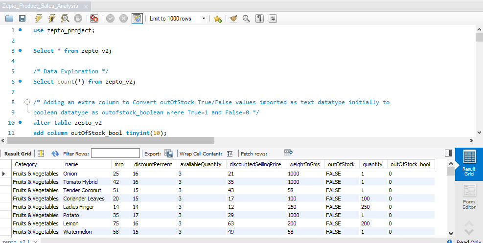
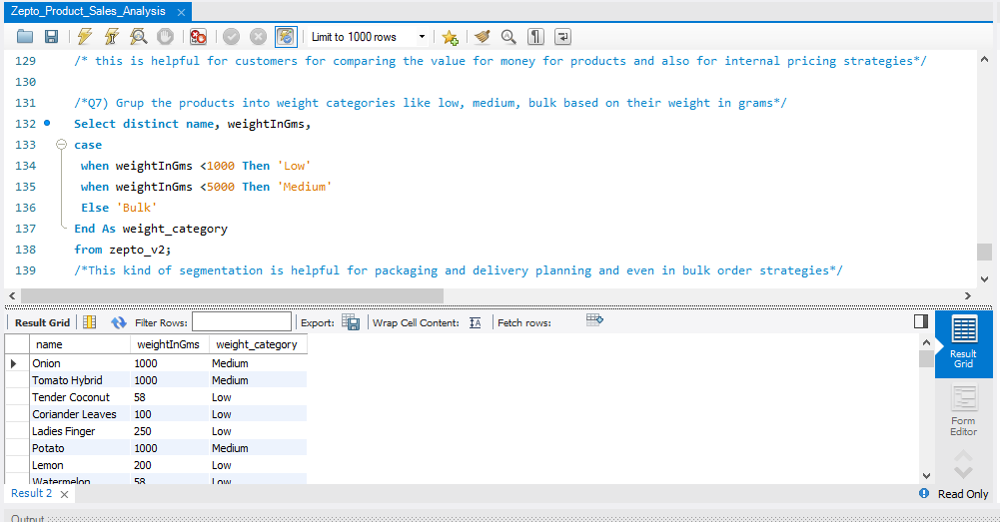
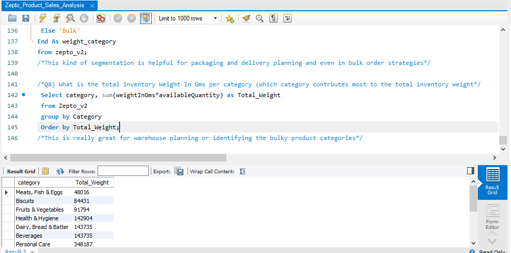

# Zepto-Sales-Analysis-using-Mysql
Worked on the Zepto sales Analysis using Mysql and performed the Data Cleaning, Exploratory Analysis, Inventory Analysis, Discount Analysis, Category Performance, and Revenue Estimation, for the Quick Commerce Platform (Zepto), based on the sales dataset.

# Zepto Product Sales Analysis using MySQL

## Tools Used

1) MySQL
2) SQL
3) Data Cleaning
4) Data Analysis
5) Exploratory Data Analysis (EDA)

## Project Overview

This project analyzes Zepto product sales and inventory data using MySQL to understand product performance, pricing, discounts, and stock availability. The analysis was performed on a dataset containing 3,728 products across 14 product categories.

## Analysis Performed

1) Analyzed product pricing, discounts, and inventory data across 3,728 products and 14 categories.
2) Cleaned and validated product and pricing information to improve data quality before analysis.
3) Evaluated key metrics such as Total Products (3,728), Products In Stock (3,275), and Products Out of Stock (453).
4) Analyzed category-wise product distribution, discount trends, and stock availability.
5) Identified products with high discounts, premium pricing, and low stock levels to understand inventory and pricing patterns.

## SQL Concepts Used

1) Aggregate Functions (SUM, AVG, COUNT, MIN, MAX)
2) GROUP BY
3) HAVING
4) CASE Statements
5) Subqueries
6) Common Table Expressions (CTEs)
7) ORDER BY
8) DISTINCT
9) Data Cleaning and Data Transformation

## Key Insights

1) The dataset contains 3,728 products spread across 14 categories.
2) Approximately 88% of products were in stock (3,275 products), while 453 products were out of stock.
3) Product pricing and discount patterns varied across categories.
4) Several products had high discounts, while some premium-priced products had limited discounts.
5) Stock availability differed across categories, highlighting potential inventory planning opportunities.

## Skills Demonstrated

SQL Querying, Data Cleaning, Exploratory Data Analysis, Business Data Analysis, Inventory Analysis, Retail Analytics,Data-Driven Decision Making.

## Project Screenshots

### Dataset Overview

### Sales Analysis Dashboard - 1

### Sales Analysis Dashboard - 2

### Sales Analysis Dashboard - 3

